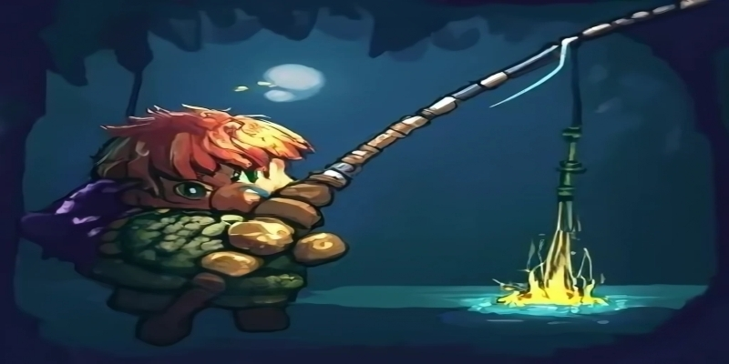

<div align="center">
    
</div>

<h1 align="center">Terraria Auto Fisher</h1>


<details open="open" style="font-size: 18px">
<summary>Table of Contents</summary>

- [Project Description](#project-description)
- [Getting Started](#getting-started)
    - [Install](#install)
    - [Usage](#usage)
        - [Tips](#tips)
- [Known Issues and Solutions](#known-issues-and-solutions)
- [Find an Issue?](#find-an-issue)
- [Credits](#credits)
- [License](#license)

</details>

---

## Project description

Fishing can be a relaxing and rewarding activity, but it can also be time-consuming. The bot will assist you in fishing
if you're not interested in spending time on it. All you need to do is get to the water, have a lure, and turn on the
bot he will do the rest: throwing, waiting for a bite, catching, and so on in a circle.

## Getting Started

### Install

1. Clone the project
2. Install all requirement packages

```bash
pip install -r requirements.txt
```

### Usage

1. Start the program by running `main.py`.
2. Ensure that Terraria is the active window.
3. Move your mouse cursor to a body of water where you want to fish.
4. Sit back, relax, and enjoy automated fishing!

That's it! The bot will take care of the fishing process, allowing you to enjoy the game without the hassle of manual
fishing.

#### Tips

1. Even if the bot is fishing for you, he cannot obtain a lure by himself, so provide it to him
2. Turn off **Waves Quality** to improve the bot's efficiency.
3. Don't place your mouse cursor on water-level.
4. Make sure to put as much light as you can during the night. The bot's efficiency will improve if he is able to see
   the bobber more clearly.
5. Make sure your fishing spot is comfortable and free of monsters

## Known Issues and Solutions

### Issue 1: win32ui.error: CreateCompatibleDC failed

**Solution:** Seems like Terraria is minimized. It seems like Terraria is minimized. The error can be removed by
expanding the game and bringing it into focus.

### Issue 2: The bot is stuck after it throws the bobber, but there is no bobber on the screen

**Solution:** Just throw a bobber yourself and the bot will start to work normally 😉

### Issue 3: The bot doesn't see my bobber

**Solution:** AAs a novice in CV, the model is not well-trained and may perform incorrectly at times. It's possible to
try to solve the issue by following tips. If it fails, you can activate the debug window ```
DEBUG == TRUE``` (default is FALSE) in **main.py** and play with it.

## Find an issue?

If you found an issue or would like to submit an improvement to this project, please submit an issue using the issue
tab.

## Credits

Thanks for these guides that helped me start and finish this project

- [OpenCV Object Detection in Games](https://youtube.com/playlist?list=PL1m2M8LQlzfKtkKq2lK5xko4X-8EZzFPI&si=E2ZU0TgVgjMS-L_U) -
  The playlist of how to make a bot for the game.
- [Object Detection 101 Course - Including 4xProjects | Computer Vision](https://www.youtube.com/watch?v=WgPbbWmnXJ8) -
  4 hours video of how to work with YOLO.

## License

[MIT License](LICENSE)
